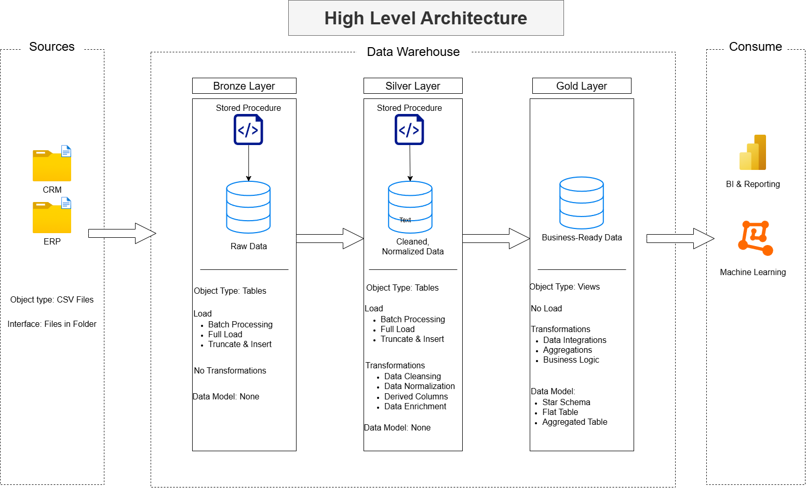

# Data Warehouse and Analytics Project

Welcome to the **Data Warehouse and Analytics Project** repo!
This project showcases an end to end data warehousing analytics solution by building a data warehouse to generating actionable insights. Designed as a portfolio project, it highlights industry modern day warehouse best practices in data engineering and analytics.

---
## Data Architecture

The data architecture for this project follows Medallion Architecture **Bronze**, **Silver**, and **Gold** layers:

1. **Bronze Layer**: Stores raw data as-is from the source systems. Data is ingested from CSV Files into SQL Server Database.
2. **Silver Layer**: This layer includes data cleansing, and normalization processes to prepare data for analysis.
3. **Gold Layer**: Data Mart with business-ready data modeled into a star schema required for reporting and analytics.

---
## Project Overview

This project involves:

1. **Data Architecture**: Designing a Modern Data Warehouse using Medallion Architecture **Bronze**, **Silver**, and **Gold** layers.
2. **ETL Pipelines**: Extracting, Transforming, and loading data from source systems into the warehouse.
3. **Data Modeling**: Designing Fact and Dimension tables optimized for analytics.

